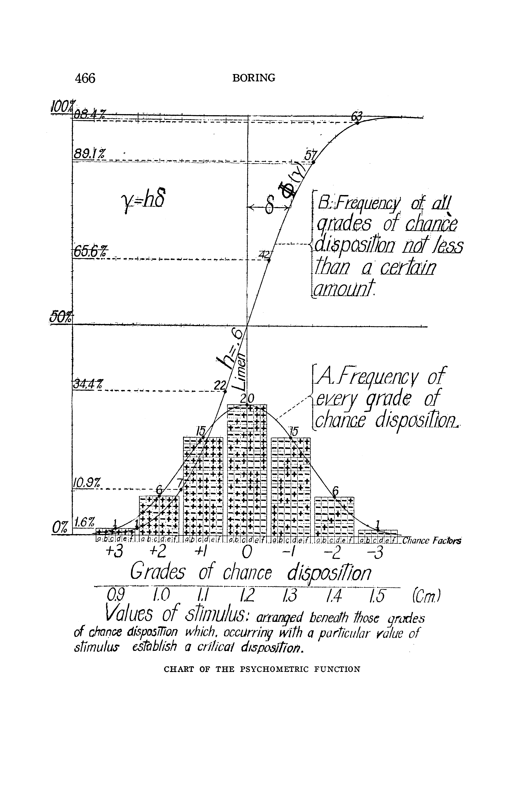

--- 
title: "THESIS TITLE: SOME CATCHY LINE"
author: "WHAT'S YOUR NAME"
date: "May/August/December, 20XX"
site: bookdown::bookdown_site
bibliography: [bibliography.bib]
biblio-style: apalike
link-citations: yes
---
```{r include=FALSE, cache=FALSE}
set.seed(12)
options(digits = 4)

knitr::opts_chunk$set(
  # Text Results
  eval = TRUE,
  echo = FALSE,
  results = 'markup',
  collapse = TRUE,
  warning = FALSE,
  error = FALSE,
  message = FALSE,
  # Code Decoration
  comment = "#>",
  background = '#F7F7F7',
  # Cache
  cache = TRUE,
  # Plots
  fig.show = "hold",
  fig.asp = 0.618,  # 1 / phi
  out.width = "70%",
  fig.align = 'center'
)

# options(dplyr.print_min = 6, dplyr.print_max = 6)
```

# Introduction {#ch1}

```{r ch1-setup, include=FALSE}
library(tidyverse)
```

example of r plot

```{r rplot, fig.cap="My first figure"}
curve(dnorm(x), -6, 6)
```

example of ggplot

```{r ggplot, fig.cap="My second figure"}
ggplot(tibble(x = c(-4, 4), y = c(0, 1)), aes(x, y)) +
  geom_hline(yintercept = 0, lwd = 0.5) +
  geom_vline(xintercept = 0, lwd = 0.5) +
  stat_function(fun = plogis, args = list(location = 1), size = 1.5, 
                color = "steelblue") +
  geom_segment(aes(x = 0, xend = qlogis(0.5, 1), y = 0.5, yend = 0.5),
               lty = "dotted") +
  geom_segment(aes(x = qlogis(0.5, 1), xend = qlogis(0.5, 1), y = 0, yend = 0.5),
               lty = "dotted") +
  geom_segment(aes(x = 0, xend = qlogis(0.84, 1), y = 0.84, yend = 0.84),
               lty = "dotted") +
  geom_segment(aes(x = qlogis(0.84, 1), xend = qlogis(0.84, 1), y = 0, yend = 0.84),
               lty = "dotted") +
  annotate("segment", x = qlogis(0.5, 1), xend = qlogis(0.84, 1), 
           y = 0.25, yend = 0.25, size = 0.5, color = "gray32",
           arrow = arrow(ends = "both", type = "closed")) +
  annotate("label", x = mean(qlogis(c(0.5, 0.84), 1)), y = 0.25, label = "JND") +
  annotate("segment", 
           x = -1, xend = qlogis(0.5, 1),
           y = 0.84, yend = 0.5, color = "gray32",
           arrow = arrow(type = "closed")) +
  annotate("label", x = -1, y = 0.84, label = "PSS", hjust = 1, vjust = 0) +
  annotate("segment", x = -2, xend = -1.5, 
           y = 0.25, yend = plogis(-1.5, 1), color = "gray32",
           arrow = arrow(type = "closed")) +
  annotate("label", x = -2, y = 0.25, label = "F(x)", vjust = 0, hjust = 1) +
  scale_y_continuous(breaks = c(0, 0.5, 0.84, 1.0)) +
  theme(axis.ticks.x = element_blank(), axis.text.x = element_blank()) +
  labs(x = "Stimulus Intensity", y = "Probability",
       title = "Components of the Psychometric Function, F")
```


example of included graphics

```{r png, fig.cap="My third figure"}

```
```{r include=FALSE, cache=FALSE}
# Remove all objects
rm(list = ls(all.names = TRUE))

# Unload all packages
pacman::p_unload(pacman::p_loaded(), character.only = TRUE)
```

<!--chapter:end:index.Rmd-->

```{r include=FALSE, cache=FALSE}
set.seed(12)
options(digits = 4)

knitr::opts_chunk$set(
  # Text Results
  eval = TRUE,
  echo = FALSE,
  results = 'markup',
  collapse = TRUE,
  warning = FALSE,
  error = FALSE,
  message = FALSE,
  # Code Decoration
  comment = "#>",
  background = '#F7F7F7',
  # Cache
  cache = TRUE,
  # Plots
  fig.show = "hold",
  fig.asp = 0.618,  # 1 / phi
  out.width = "70%",
  fig.align = 'center'
)

# options(dplyr.print_min = 6, dplyr.print_max = 6)
```
# Using Tables {#ch2}

```{r ch2-setup, include=FALSE}
library(tidyverse)
library(kableExtra)
```

example of a reference [@britannica2014editors].

example of display math

$$
\frac{\Delta I}{I} = k
$$

Example of inline math $\Delta I = 0.2$

## Level 2 Heading

example of a table and reference (table \@ref(tab:my-table))

```{r my-table}
iris %>%
  slice_sample(n = 10) %>%
  kable(booktabs = TRUE, caption = "THIS IS MY TABLE!") %>%
  kable_styling(latex_options = c("hold_position", "striped"))
```

```{r include=FALSE, cache=FALSE}
# Remove all objects
rm(list = ls(all.names = TRUE))

# Unload all packages
pacman::p_unload(pacman::p_loaded(), character.only = TRUE)
```

<!--chapter:end:020-tables.Rmd-->

```{r include=FALSE, cache=FALSE}
set.seed(12)
options(digits = 4)

knitr::opts_chunk$set(
  # Text Results
  eval = TRUE,
  echo = FALSE,
  results = 'markup',
  collapse = TRUE,
  warning = FALSE,
  error = FALSE,
  message = FALSE,
  # Code Decoration
  comment = "#>",
  background = '#F7F7F7',
  # Cache
  cache = TRUE,
  # Plots
  fig.show = "hold",
  fig.asp = 0.618,  # 1 / phi
  out.width = "70%",
  fig.align = 'center'
)

# options(dplyr.print_min = 6, dplyr.print_max = 6)
```
# Using Equations {#ch3}

Example of equations

\begin{equation}
  Y \sim \textrm{Bernoulli}(\pi)
  (\#eq:psyoutcome)
\end{equation}


\begin{equation}
  \pi = P(Y=1 \vert x; \theta) = F(x; \theta)
   (\#eq:bernprob1)
\end{equation}


\begin{equation}
  P(Y=y | x; \theta) = F(x;\theta)^y(1-F(x;\theta))^{1-y}
  (\#eq:bernproby)
\end{equation}

The likelihood function $\mathcal{L}$ can be determined using equation \@ref(eq:bernproby)

\begin{equation}
  \begin{split}
    \mathcal{L}(\theta | y, x) &= \prod_{i}^{N} P(y_i | x_i; \theta) \\
    &= \prod_{i}^{N}F(x_i;\theta)^{y_i}(1-F(x_i;\theta))^{1-y_i}
  \end{split}
  (\#eq:bernlik)
\end{equation}

Equation \@ref(eq:bernlik) is commonly expressed in terms of its logarithm.

\begin{equation}
  \ln \mathcal{L}(\theta | y, x) = \sum_{i}^{N} y_i \ln\left(F(x_i;\theta)\right) + (1-y_i) \ln\left(F(x_i;\theta))\right)
  (\#eq:bernloglik)
\end{equation}
```{r include=FALSE, cache=FALSE}
# Remove all objects
rm(list = ls(all.names = TRUE))

# Unload all packages
pacman::p_unload(pacman::p_loaded(), character.only = TRUE)
```

<!--chapter:end:030-equations.Rmd-->

```{r include=FALSE, cache=FALSE}
set.seed(12)
options(digits = 4)

knitr::opts_chunk$set(
  # Text Results
  eval = TRUE,
  echo = FALSE,
  results = 'markup',
  collapse = TRUE,
  warning = FALSE,
  error = FALSE,
  message = FALSE,
  # Code Decoration
  comment = "#>",
  background = '#F7F7F7',
  # Cache
  cache = TRUE,
  # Plots
  fig.show = "hold",
  fig.asp = 0.618,  # 1 / phi
  out.width = "70%",
  fig.align = 'center'
)

# options(dplyr.print_min = 6, dplyr.print_max = 6)
```
# (APPENDIX) Appendix {-}

# Supplementary Code

One model, Three Implementations. There are a few ways to specify a hierarchical model in R. Below I describe three common frameworks that require varying levels of mathematical and programmatic competence. Frameworks with lower barriers for entry are great for researchers in many fields, but they lack fine control over the parameters in a model. As the framework complexity increases, so too does the ability to generate complex models that are typically not possible. 

Novice
\setstretch{1.0}
```{r, eval=FALSE, echo=TRUE}
library(rstanarm)
stan_glmer(cbind(k, n-k) ~ 1 + x + (1 + x | G1) + (1 + x | G2), 
           family = binomial(link = "logit"),
           data = dat)
```
\setstretch{2.0}

Intermediate

\setstretch{1.0}
```{r, eval=FALSE, echo=TRUE}
library(rethinking)
ulam(alist(
  k ~ binomial(n, pi)
  logit(pi) <- (a + aG1[G1] + aG2[G2]) + (b + bG1[G1] + bG2[G2]) * x,
  
  a ~ normal(0, 10),
  aG1[G1] ~ normal(0, sd_aG1),
  aG2[G2] ~ normal(0, sd_aG2),
  c(sd_aG1, sd_aG2) ~ half_cauchy(0, 10),

  b ~ normal(0, 10),
  bG1[G1] ~ normal(0, sd_bG1),
  bG2[G2] ~ normal(0, sd_bG2),
  c(sd_bG1, sd_bG2) ~ half_cauchy(0, 10)
), data = dat, log_lik = TRUE)
```
\setstretch{2.0}
```{r include=FALSE, cache=FALSE}
# Remove all objects
rm(list = ls(all.names = TRUE))

# Unload all packages
pacman::p_unload(pacman::p_loaded(), character.only = TRUE)
```

<!--chapter:end:200-appendix.Rmd-->

```{r include=FALSE, cache=FALSE}
set.seed(12)
options(digits = 4)

knitr::opts_chunk$set(
  # Text Results
  eval = TRUE,
  echo = FALSE,
  results = 'markup',
  collapse = TRUE,
  warning = FALSE,
  error = FALSE,
  message = FALSE,
  # Code Decoration
  comment = "#>",
  background = '#F7F7F7',
  # Cache
  cache = TRUE,
  # Plots
  fig.show = "hold",
  fig.asp = 0.618,  # 1 / phi
  out.width = "70%",
  fig.align = 'center'
)

# options(dplyr.print_min = 6, dplyr.print_max = 6)
```
`r if (knitr:::is_html_output()) '
# References {-}
'`
\setstretch{1.0}
```{r include=FALSE, cache=FALSE}
# Remove all objects
rm(list = ls(all.names = TRUE))

# Unload all packages
pacman::p_unload(pacman::p_loaded(), character.only = TRUE)
```

<!--chapter:end:300-references.Rmd-->

